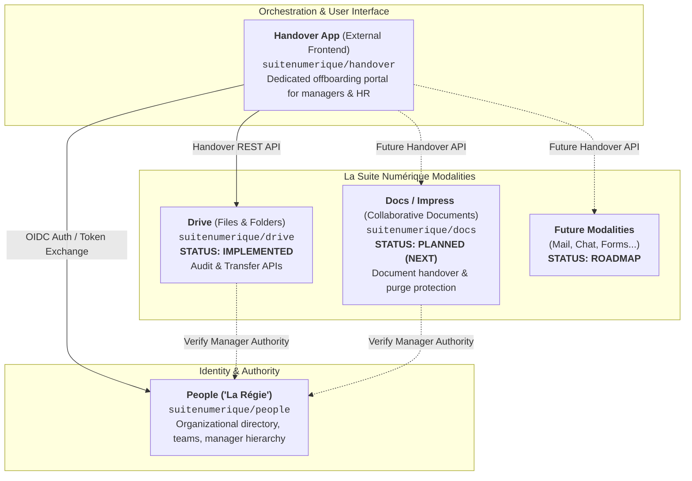
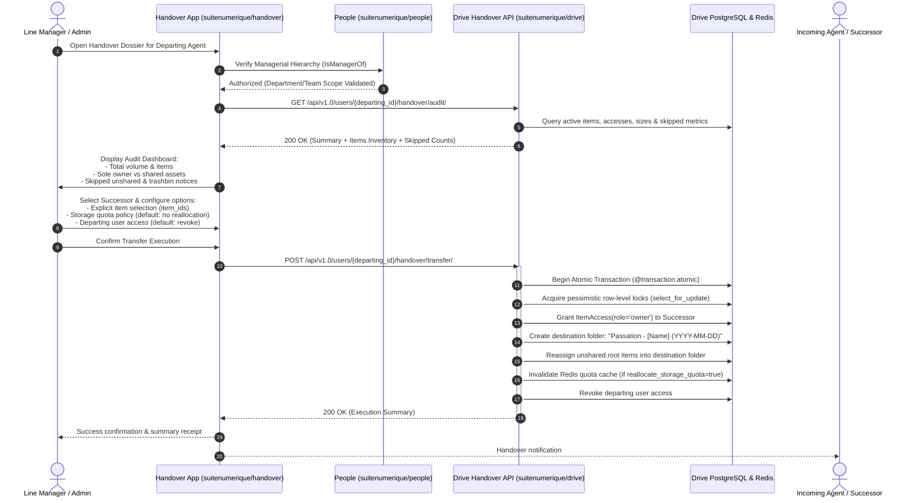
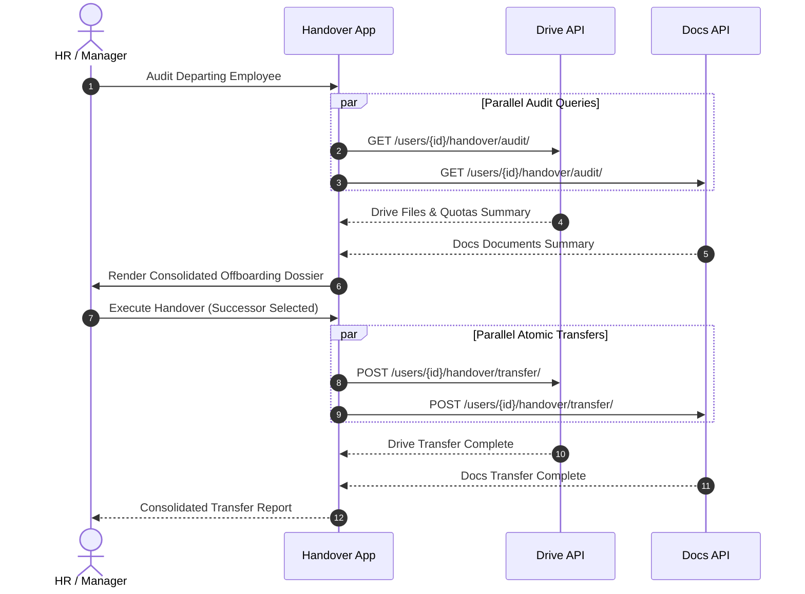

# Technical Study & Specification: File and Document Ownership Transfer & Handover API

## Manager-Led Offboarding in La Suite Numérique

This document provides a comprehensive technical and architectural specification for the **Handover & Ownership Transfer** capabilities across **La Suite Numérique** (the French Public Service and partner state sovereign workspace).

It examines how ownership and storage accountability operate across modalities, details the completed **Drive Handover API**, provides integration guidance for the standalone **Handover Application** (`suitenumerique/handover`), outlines the roadmap for upcoming modalities (**Docs / Impress**), and ensures strict compliance with EU and French legal frameworks (GDPR, ECHR Article 8, workplace privacy jurisprudence, and public archives continuity).

---

## 1. Multi-Repo Architecture & Modality Overview

In La Suite Numérique, offboarding and handover are designed as a decoupled, multi-service architecture:



### Component Roles

1. **The Handover App (`suitenumerique/handover`)**:
   - A dedicated external frontend application outside of Drive and Docs.
   - Provides an intuitive administrative portal for department heads, managers, and HR administrators to oversee departures, audit resources across services, select successors, and execute atomic ownership handovers.
2. **Drive (`suitenumerique/drive`) — Implemented Modality**:
   - Provides the first fully operational Handover API (`/api/v1.0/users/{id}/handover/audit/` and `/transfer/`).
   - Implements two-phase audit/transfer workflows, transparency counts for unshared/trashbin items, row-level locking, and decoupled storage quota handling.
3. **Docs / Impress (`suitenumerique/docs`) — Planned Modality**:
   - Next service to implement the standardized handover contract.
   - Specifically targets preventing catastrophic document destruction under `_delete_documents_single_owner()`.
4. **People / La Régie (`suitenumerique/people`)**:
   - The authoritative source for managerial hierarchy, team affiliations, and organization (SIRET) scopes.

---

## 2. Comparative Analysis: Drive vs Docs

| Aspect / Capability | Drive ([`suitenumerique/drive`](https://github.com/suitenumerique/drive)) | Docs / Impress ([`suitenumerique/docs`](https://github.com/suitenumerique/docs)) |
| :--- | :--- | :--- |
| **Tree Hierarchy** | PostgreSQL `ltree` extension ([`core/models.py`](../src/backend/core/models.py)), dot-separated UUID paths (`uuid1.uuid2`). | Materialized Path (`MP_Node`, `django-treebeard`), fixed-step alphanumeric paths (`steplen = 7`). |
| **Available Roles** | `reader`, `editor`, `admin`, `owner` ([`RoleChoices`](../src/backend/core/models.py)) | `reader`, `commenter`, `editor`, `admin`, `owner` (`RoleChoices`) |
| **Ownership Representation** | **Explicit access record**: [`ItemAccess`](../src/backend/core/models.py) with `role = "owner"`. | **Explicit access record**: `DocumentAccess` with `role = "owner"`. |
| **Multi-Owner Support** | **Yes**: Multiple users/teams can hold `role = "owner"` on the same item. | **Yes**: Multiple users/teams can hold `role = "owner"` on the same document. |
| **`creator` Field** | [`Item.creator`](../src/backend/core/models.py) (`ForeignKey(User, on_delete=RESTRICT)`). | `Document.creator` (`ForeignKey(User, on_delete=RESTRICT, null=True)`). |
| **Storage Quota Impact** | **Critical**: Storage quota is counted against [`Item.creator`](../src/backend/core/models.py), NOT on `ItemAccess`. | **None**: Docs has no storage quota tracking per user. |
| **Last-Owner Protection** | Prevents removing or demoting the last owner on root items ([`viewsets.py`](../src/backend/core/api/viewsets.py)). | Prevents leaving or demoting the role if the user is the sole owner. |
| **Handover Status** | **Implemented**: Audit and Transfer endpoints active in core API. | **Planned**: Standardized Handover endpoints to be added in next iteration. |
| **Tree Move Effects** | Moving to root without access reassigns `creator` and grants `owner`. Moving inside folders cleans lower explicit accesses ([`services/accesses.py`](../src/backend/core/services/accesses.py)). | Moving across root trees wipes direct accesses to inherit destination tree scope. |
| **Account Reconciliation** | Reassigns `ItemAccess`, `ItemFavorite`, `LinkTrace`, `Item.creator` (+ invalidates quota cache), and `Invitation.issuer`. | Reassigns `DocumentAccess`, `DocumentFavorite`, `LinkTrace`, threads, comments, and reactions. Does NOT reassign `Document.creator`. |
| **User Deletion Behavior** | **Fails with `RestrictedError`** if the user created any items. Policy expects account deactivation (`is_active = False`). | > [!CAUTION]<br>**Irreversible Data Destruction**: `_delete_documents_single_owner()` permanently deletes all documents where the user was the sole owner! |

---

## 3. Technical Realities & Architectural Pitfalls

### 3.1. Drive: The Storage Quota Disconnect

In Drive, permissions and quotas are decoupled by design:

1. **Administrative Rights**: Managed by [`ItemAccess`](../src/backend/core/models.py). An `owner` can rename, move, delete, share, and invite other collaborators.
2. **Quota Accountability**: Managed by [`Item.creator`](../src/backend/core/models.py). Storage consumption is computed via:

   ```sql
   SELECT SUM(size) FROM drive_item WHERE creator_id = %s AND deleted_at IS NULL;
   ```

   Redis caches this value via `invalidate_storage_used_cache([user_id])`.
3. **The Quota Trap in Handover**:
   - If an offboarding workflow blindly reassigns `Item.creator` to the incoming successor, the successor's personal or departmental storage quota may immediately be overwhelmed by gigabytes of departmental archives.
   - Conversely, if `Item.creator` is never reassigned, the departing user continues to bear the quota burden in reporting systems.
   - **Drive Handover Resolution**: By default, `reallocate_storage_quota = False`. The successor receives administrative ownership (`ItemAccess(role='owner')`), while `Item.creator` is preserved to keep storage charged to the predecessor's organizational budget. An explicit option (`reallocate_storage_quota = True`) allows quota reassignment when requested.

### 3.2. Docs: The Deletion Purge Hazard

Docs overrides `User.delete()`:

```python
def delete(self, using=None, keep_parents=False):
    with transaction.atomic():
        self._delete_user_shared_documents_accesses() # Leaves multi-owner docs intact
        self._delete_documents_single_owner()         # PERMANENTLY PURGES single-owner docs!
        self._clear_user_created_documents()          # Sets creator=None on remaining docs
        return super().delete(using=using, keep_parents=keep_parents)
```

- If an administrator deactivates or cleans up a departing user before performing a document handover:
  - **All unshared documents or documents where the agent was sole owner are immediately purged from PostgreSQL and object storage.**
  - There is no soft-delete or trashbin recovery for this purge.
  - > [!CAUTION]
    > **Public Records Liability**: Under French law (*Code du patrimoine*, Art. L. 211-1), all digital documents and data created by public agents in the exercise of their duties are legally **public archives from inception** (*"y compris les données, quel que soit le support"*). Deleting these documents without archival authorization (*visa d'élimination*) constitutes a criminal offense under **Article L. 214-3 Code du patrimoine** (3 years imprisonment, €45,000 fine) and **Article 432-15 Code pénal** (unlawful destruction of public records: 10 years imprisonment, €1,000,000 fine).
  - **Docs Handover Requirement**: The upcoming Docs Handover API must reassign `DocumentAccess(role='owner')` and update `Document.creator = successor` *before* account deactivation or deletion occurs.

---

## 4. Manager-Led Transfer Workflow

### 4.1. Why the Manager Must Steer the Handover

In public sector and enterprise organizations, departing employees frequently:
- Depart abruptly (mutation, sick leave, end of contract, resignation) without organizing their files.
- Store work-related files in their private root workspace without sharing them.
- Do not know who will succeed them.

Therefore, the **line manager** or an **authorized organization administrator** must have the supervisory tooling (via the standalone Handover App) to:
1. **Audit** the departing agent's digital assets (counts, storage volume, sole-owner vs shared state, skipped items).
2. **Designate a successor** (colleague, manager, or shared departmental space).
3. **Execute an atomic transfer** to guarantee service continuity.

### 4.2. End-to-End Orchestration Flow



---

## 5. EU & French Legal Framework: Rigorous Statutory Verification

Empowering a manager to audit and transfer an employee's files directly intersects with European fundamental rights and data protection laws. The technical implementation strictly adheres to the following statutory framework:

### 5.1. GDPR (Regulation EU 2016/679)

1. **Lawful Basis (Article 6)**:
   - **Public Sector**: The handover process is justified under **Article 6(1)(e)** ("task carried out in the public interest or in the exercise of official authority") and **Article 6(1)(c)** ("compliance with a legal obligation" under public archival and administrative continuity statutes).
   - **Restriction for Public Bodies**: Under **Article 6(1) second subparagraph**, public authorities are **expressly prohibited** from relying on Article 6(1)(f) ("legitimate interests") when performing tasks within their public remit.
   - **Private Sector**: Relies on **Article 6(1)(f)** ("legitimate interests" of business continuity) balanced against employee rights, subject to **Article 88** (national rules on employee data processing).
2. **Purpose Limitation (Article 5(1)(b))**:
   - The transfer is strictly confined to ensuring **business and public service continuity** (*continuité du service public*). It cannot be repurposed for disciplinary investigations or performance surveillance.
3. **Data Minimization (Article 5(1)(c))**:
   - The manager audit screen displays **metadata only** (titles, sizes, update dates, sharing counts) rather than exposing indiscriminate file content previews or opening private documents.
4. **Accountability & Logging (Article 5(2))**:
   - Every administrative audit query and ownership transfer produces an immutable audit log recording the manager's identity, IP address, timestamp, affected resource IDs, and recipient.
5. **Right to Erasure Limitations (Article 17)**:
   - Under **Article 17(3)(b) and 17(3)(d)**, public sector employees **cannot** invoke the "right to be forgotten" to demand the erasure of professional files or public documents. Personal files inadvertently stored, however, must be purged under Article 17(1).
6. **Right of Access (Article 15)**:
   - Under *Cass. soc., 18 juin 2025 (n° 23-19.022)*, professional emails and digital communications contain personal data; departing workers retain an enforceable right of access to their own data under Art. 15 GDPR, but this does not confer any exclusive right of retention over administrative records.

### 5.2. ECHR Article 8 & Workplace Privacy Jurisprudence

- **Foundational Jurisprudence**: *Halford v. UK (1997)* and *Copland v. UK (2007)* established that employees have a **reasonable expectation of privacy** regarding workplace communications and files.
- **The Six Procedural Criteria (*Bărbulescu v. Romania [GC 2017]*)**: Employer monitoring must satisfy six cumulative criteria: prior notification, restricted spatial/temporal scope, legitimate aim, subsidiarity (less intrusive methods), proportional consequences, and procedural safeguards.
- **The Cornerstone French Case (*Libert c. France, 22 Feb 2018, no. 588/13*)**:
  - The ECHR validated France's presumption of professional use and ruled that naming a folder **"données personnelles" (personal data)** was **insufficient** to confer Article 8 privacy protection, as employees routinely process personal data for work.
  - To benefit from secrecy of correspondence, the folder/file must be explicitly labeled **"Personnel"** or **"Privé"**.

### 5.3. French Labor & Administrative Law

1. **The Presumption of Professional Use (*Présomption de professionnalisme*)**:
   - Formulated by *Cass. soc., 17 mai 2005 (Cathonet)* and consecrated by *Cass. soc., 18 octobre 2006* (extended to emails by *Cass. soc., 30 mai 2007* & *15 déc. 2010*): files and communications on work tools are **presumed professional**.
   - The line manager has the full legal right to open, inspect, and reassign them for business continuity, **even in the employee's absence**, without prior notice.
   - Transposed to the public sector by administrative courts (*CAA Douai, 26 mai 2011*; *CAA Marseille, 10 mai 2016*; *CAA Toulouse, 20 juin 2023*; *CE, 20 févr. 2026, n° 497066*).
2. **Protection of Personal Files (*Arrêt Nikon*, Cass. soc., 2 oct. 2001, n° 99-42.942)**:
   - Files and folders explicitly marked as **"Personnel"** or **"Privé"** are protected by the secrecy of correspondence (Art. 9 Code civil, Art. 8 ECHR, Art. 226-15 Code pénal).
   - A manager **cannot open or transfer** these files in the employee's absence, except when authorized under a judicial order (*ordonnance sur requête*, Art. 145 CPC) or in case of a severe emergency (*risque ou événement particulier*).
3. **Public Archives (*Code du patrimoine*, Art. L. 211-1 et seq.)**:
   - All digital documents and data created by public agents are **public archives** from inception. Unauthorized destruction is a criminal misdemeanor (*Art. L. 214-3*: 3 years imprisonment, €45,000 fine; *Art. 432-15 Code pénal*: 10 years imprisonment, €1,000,000 fine).
4. **Public Service Continuity & Statutory Duties (*Code général de la fonction publique - CGFP*)**:
   - Under the constitutional principle of public service continuity and statutory duties (**Articles L. 121-1, L. 121-7, L. 121-9, and L. 121-10 CGFP** on hierarchical obedience):
     - Public agents have **no property right and no right of retention** over administrative creations (*Code de la propriété intellectuelle*, Art. L. 131-3-1).
     - Agents are legally required to execute handover instructions. Withholding access or deleting professional files constitutes a serious disciplinary offense.
5. **Procedural Safeguards via Pre-Departure Grace Period**:
   - Administrations must provide pre-departure notice and a self-service window for employees to export private files and clean their workspaces prior to account deactivation.

---

## 6. Drive Handover API: Technical Specification & Implementation

The Drive Handover API is fully implemented within [`suitenumerique/drive`](https://github.com/suitenumerique/drive), exposed via [`UserViewSet`](../src/backend/core/api/viewsets.py) and encapsulated in [`core/services/handover.py`](../src/backend/core/services/handover.py).

### 6.1. Endpoint 1: Handover Audit

- **HTTP Route**: `GET /api/v1.0/users/{user_id}/handover/audit/`
- **Permission**: `IsAuthenticated, IsManagerOf`
- **Purpose**: Compiles a comprehensive inventory of the departing employee's files and folders, computing summary metrics and transparent counts for items outside the shared transfer perimeter.

#### Summary Metrics & Transparency Schema

The audit endpoint returns high-level metrics accompanied by an explicit breakdown of skipped items:

```json
{
  "departing_user": {
    "id": "2c6c1f9f-9b0a-46b9-be85-d63983d1a750",
    "email": "subordinate@example.com",
    "full_name": "John Doe (Departing Employee)"
  },
  "summary": {
    "total_items": 19,
    "total_bytes": 183756048,
    "sole_owner_count": 14,
    "shared_count": 5,
    "skipped_unshared_count": 2,
    "skipped_unshared_bytes": 180000,
    "skipped_trash_count": 2,
    "skipped_trash_bytes": 320000
  },
  "items": [
    {
      "id": "a0000000-0000-0000-0000-000000000001",
      "title": "root_notes.txt",
      "type": "file",
      "size": 2048,
      "role": "owner",
      "is_sole_owner": true,
      "is_shared": true,
      "other_accesses_count": 1,
      "created_at": "2026-09-16T12:00:00Z",
      "updated_at": "2026-09-16T12:00:00Z",
      "path": "/root_notes.txt",
      "is_skipped_unshared": false
    }
  ]
}
```

#### Meaning of Metrics

- `total_items`: Total number of active files and folders administered by the departing user.
- `sole_owner_count`: Items where the departing user is the **only owner** (`other_owners_count == 0`). These represent assets at risk of orphanhood.
- `shared_count`: Items with active collaborators (`other_accesses_count > 0`).
- `skipped_unshared_count` & `skipped_unshared_bytes`: Active items in the user's personal root workspace that have **zero collaborators**. Transparently reported so administrators understand what remains untransferred.
- `skipped_trash_count` & `skipped_trash_bytes`: Soft-deleted items currently in the trashbin, preserved under public archive rules.

---

### 6.2. Endpoint 2: Handover Transfer (Dry-Run & Execution)

- **HTTP Route**: `POST /api/v1.0/users/{user_id}/handover/transfer/`
- **Permission**: `IsAuthenticated, IsManagerOf`
- **Purpose**: Atomically transfers ownership of items to a designated recipient. Supports a dry-run validation preview mode as well as transactional execution.

#### Request Parameters

| Parameter | Type | Required | Default | Description |
| :--- | :--- | :--- | :--- | :--- |
| `recipient_id` | `UUID` / `string` | **Yes** | — | UUID or email of the incoming successor. |
| `item_ids` | `UUID[]` | **Yes** | — | Explicit list of root item IDs selected by the manager. If a folder ID is passed, all its descendants are automatically cascaded. |
| `dry_run` | `boolean` | No | `false` | When `true`, simulates transfer, checks recipient quota, and returns summary without modifying the database. |
| `reallocate_storage_quota` | `boolean` | No | `false` | When `false` (default), preserves `Item.creator` to keep storage volume charged to the predecessor's budget. When `true`, reassigns `Item.creator = recipient`. |
| `departing_user_action` | `string` | No | `"revoke"` | `"revoke"` (removes departing user's access) or `"keep_reader"` (demotes departing user to reader). |

#### Request Payload Example

```json
{
  "recipient_id": "2d915b4b-a763-4190-83a9-7380982d561e",
  "item_ids": [
    "a0000000-0000-0000-0000-000000000001",
    "a0000000-0000-0000-0000-000000000020"
  ],
  "dry_run": false,
  "reallocate_storage_quota": false,
  "departing_user_action": "revoke"
}
```

#### Response Example (`200 OK`)

```json
{
  "dry_run": false,
  "status": "completed",
  "summary": {
    "items_transferred": 5,
    "bytes_reallocated": 0,
    "reallocate_storage_quota": false,
    "departing_user_action": "revoke",
    "destination_folder_id": "a0000000-0000-0000-0000-000000000099"
  },
  "recipient": {
    "id": "2d915b4b-a763-4190-83a9-7380982d561e",
    "email": "drive@drive.world"
  },
  "items": [
    {
      "id": "a0000000-0000-0000-0000-000000000001",
      "title": "root_notes.txt",
      "type": "file",
      "size": 2048,
      "depth": 1
    }
  ]
}
```

#### Atomic Execution Guarantees (`@transaction.atomic`)

1. **Pessimistic Row-Level Locks**: Employs `Item.objects.select_for_update()` to prevent TOCTOU race conditions (e.g. concurrent moves or deletions).
2. **Quota Verification**: If `reallocate_storage_quota = True`, verifies that the recipient has sufficient available storage in their quota before applying changes.
3. **Destination Folder Isolation**: Creates a dedicated folder (`"Passation - [Full Name] (YYYY-MM-DD)"`) in the recipient's root workspace, moving unshared root files into it to avoid cluttering the successor's drive.
4. **Dual Reassignment**:
   - Grants `ItemAccess(role=RoleChoices.OWNER)` to the recipient.
   - If `reallocate_storage_quota = True`, updates `Item.creator = recipient` and invalidates Redis quota caches via `invalidate_storage_used_cache`.
5. **Access Cleanup**: Revokes or demotes the departing user's permissions according to `departing_user_action`.

---

### 6.3. Endpoint 3: Handover File Deletion (Current Status & Planned TODO Refactor)

- **HTTP Route**: `DELETE /api/v1.0/users/{user_id}/handover/delete/`
- **Permission**: `IsAuthenticated, IsManagerOf`
- **Current Payload**: `{"item_id": "<UUID>", "title": "<string>"}`
- **Current Behavior**: Soft-deletes and immediately hard-deletes the file, dispatching Celery `process_item_purge` to permanently purge the S3 binary.

#### Planned Refactoring Scope (TODO for Future Iteration)

1. **Query Perimeter Correction**:
   - Currently, the query resolves files through `get_departing_user_administered_items(departing_user)` which restricts to shared items (`other_accesses_count > 0`). As a result, unshared/personal files (`skipped_unshared_*`) return `404 Not Found`, while shared collaborative team files are permitted to be deleted.
   - *Future change*: Refactor query to allow selecting unshared or user-created files, while protecting shared collaborative assets from unilateral deletion without co-owner consent.
2. **Lifecycle & Data Retention (*Code du patrimoine* L. 211-1)**:
   - Immediate hard-delete and S3 object purge leaves zero recovery window.
   - *Future change*: Replace hard-deletion with standard soft-deletion (`item.soft_delete()`), moving discarded files to the trashbin to adhere to public archival retention schedules.
3. **HTTP Protocol & REST Semantics**:
   - Sending a JSON payload within a `DELETE` request violates common HTTP proxy and API gateway conventions (bodies are frequently stripped).
   - *Future change*: Adopt either RESTful URL parameters (`DELETE /api/v1.0/users/{user_id}/handover/items/{item_id}/`) or a batch POST endpoint (`POST /api/v1.0/users/{user_id}/handover/delete/` with `item_ids: [...]`).
4. **Batch & Folder Support**:
   - Extend beyond single-file deletion to accept a list of `item_ids` and support empty folders or cascading folder deletion.
5. **Title Parameter Redundancy**:
   - Validate `item.title == serializer.validated_data["title"]` as a confirmation guardrail, or remove the unverified parameter.

---

## 7. External Handover Client Integration Guide

The handover user experience is hosted inside the standalone **Handover Application** ([`suitenumerique/handover`](https://github.com/suitenumerique/handover)). This section serves as the integration guide for frontend developers building or consuming offboarding workflows.

### 7.1. Authentication & Security Headers

All HTTP requests from the Handover App to Drive must include:
- **Authentication**: Session cookie (`Cookie: sessionid=...`) or OIDC Bearer token (`Authorization: Bearer <jwt>`).
- **CSRF Protection**: `X-CSRFToken: <token>` extracted from cookies.
- **CORS Configuration**: The Drive backend must allow the origin of the Handover application (`CORS_ALLOWED_ORIGINS`).

### 7.2. Client Error Handling Matrix

| HTTP Status | Condition | Recommended Client UI Action |
| :--- | :--- | :--- |
| `200 OK` | Audit compiled or transfer executed. | Render metrics dashboard or confirmation receipt. |
| `400 Bad Request` | Invalid payload, empty `item_ids`, or quota exceeded. | Display backend error message from `detail`. |
| `401 Unauthorized` | Missing or expired credentials. | Redirect user to SSO login. |
| `403 Forbidden` | `IsManagerOf` rejected (Anti-Self Handover, or caller lacks managerial rights). | Display: *"Vous n'avez pas les habilitations nécessaires pour gérer ce collaborateur."* |
| `404 Not Found` | User UUID does not exist. | Display: *"Utilisateur introuvable."* |
| `429 Too Many Requests` | Throttling limit reached. | Display: *"Trop de requêtes. Veuillez patienter avant de réessayer."* |

---

## 8. Developer Tooling & Deterministic Testing

Drive includes built-in fixtures and seeding tools to facilitate local frontend and API development:

### 8.1. Seeding Demo Scenarios

Run the idempotent handover demo command:

```bash
# Via Makefile
make handover-demo

# Or via Docker Compose
docker compose exec app-dev python manage.py create_handover_demo
```

This provisions three deterministic personas and 8 canonical test scenarios:

#### Deterministic Personas

| Persona | Email | Fixed UUID | Role / Privileges |
| :--- | :--- | :--- | :--- |
| **Manager** | `manager@example.com` | `021d6063-a251-472a-919e-325565b35c49` | Staff user with managerial supervisory rights. |
| **Subordinate** | `subordinate@example.com` | `2c6c1f9f-9b0a-46b9-be85-d63983d1a750` | Departing employee whose files are audited. |
| **Colleague** | `drive@drive.world` | `2d915b4b-a763-4190-83a9-7380982d561e` | Staff colleague and designated successor. |

#### 8 Seeded Scenarios (Deterministic Prefix: `a0000000-0000-0000-0000-`)

- **Case 0**: Root file `root_notes.txt` (`...000000000001`). Depth 1 root item.
- **Case 1**: Empty folder `1_Empty_Folder` (`...000000000010`). Tests empty container transfer.
- **Case 2**: Diverse & long filenames (`...000000000020` to `23`). Tests UI text truncation, PDFs, CSVs, images.
- **Case 3**: Deep folder hierarchy (`...000000000030` to `36`). 4-level deep hierarchy (Subfolder A, Subfolder B, Confidential Archives, ZIP, MP3).
- **Case 4**: Co-owned projects (`...000000000040` to `42`). Items where colleague is also an owner (`is_sole_owner = False`).
- **Case 5**: Subordinate is Admin / Colleague is Owner (`...000000000050` to `51`). Tests non-owner role reporting.
- **Case 6**: Unshared personal folder (`...000000000060` to `61`). Private folder with zero collaborators; verified under `skipped_unshared_count`.
- **Case 7**: Soft-deleted folder in Trashbin (`...000000000070` to `71`). Soft-deleted items; verified under `skipped_trash_count`.

### 8.2. Bruno API Collection

A complete, Git-native [Bruno](https://www.usebruno.com/) collection is available in [`bruno/`](../bruno):
- `1-Auth/`: Login as Manager, Subordinate, or Colleague with automatic cookie extraction.
- `2-Audit/`: Handover Audit and Anti-Self Audit tests.
- `4-Transfer/`: Transfer Dry-Run, Execution, Anti-Self checks, and Post-Transfer verification.
- `collection.bru`: Includes pre-request fallback variables so requests execute cleanly even when "No Environment" is selected.

---

## 9. Architectural Decisions (The "Why")

1. **Storage Quota Policy: Why Default to `reallocate_storage_quota = False`?**:
   - In Drive, storage usage is queried via `SELECT SUM(size) FROM drive_item WHERE creator_id = %s`.
   - In public administration, a successor taking over a project should not have their storage quota saturated by years of departmental archives.
   - **Decision**: Handover defaults to `reallocate_storage_quota = False`. The successor receives administrative control (`role='owner'`), while `Item.creator` remains unchanged, attributing storage to the predecessor's organization budget.
2. **What Happens to a File When its Creator is Deactivated (`is_active = False`)?**:
   - **Persistence**: Files are never deleted. `Item.creator` has `on_delete=models.RESTRICT`, preventing hard database deletion of the user.
   - **Access**: Collaborators holding `ItemAccess` retain full access. The deactivated status of the creator has zero effect on colleagues.
   - **Accountability**: Leaving `Item.creator` intact preserves the historical record of who created the file.
3. **Why Surface Transparency Counts (`skipped_unshared_*`, `skipped_trash_*`)?**:
   - Hiding unshared or trashbin items creates a false sense of completeness. Explicit counts inform administrators of the full picture while adhering to data minimization.
4. **Anti-Self Handover Rule**:
   - A departing agent cannot authorize or execute a handover on themselves. The feature is strictly supervisory for managers and administrators.

---

## 10. Roadmap: Extending Handover to Docs / Impress & Other Modalities

With the Drive Handover API fully established, upcoming iterations will extend this pattern to the rest of La Suite Numérique:

### 10.1. Next Modality: Docs / Impress (`suitenumerique/docs`)

1. **API Endpoints**:
   - `GET /api/v1.0/users/{user_id}/handover/audit/`: Reports all documents where user is creator, sole owner, or collaborator.
   - `POST /api/v1.0/users/{user_id}/handover/transfer/`: Reassigns `DocumentAccess(role='owner')` and crucially updates `Document.creator = successor`.
2. **Purge Protection**:
   - Reassigning `Document.creator` immunizes documents against the catastrophic `_delete_documents_single_owner()` purge upon user offboarding, ensuring full compliance with *Code du patrimoine* Article L. 211-1.

### 10.2. Unified Orchestration in the Handover App (`suitenumerique/handover`)

The standalone Handover App will serve as the single administrative orchestrator:


