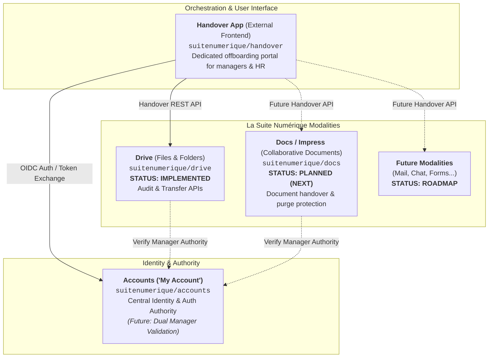
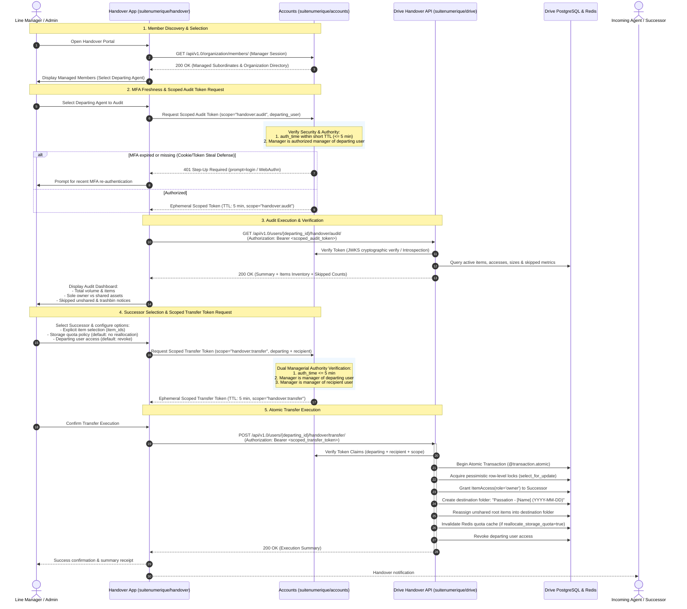
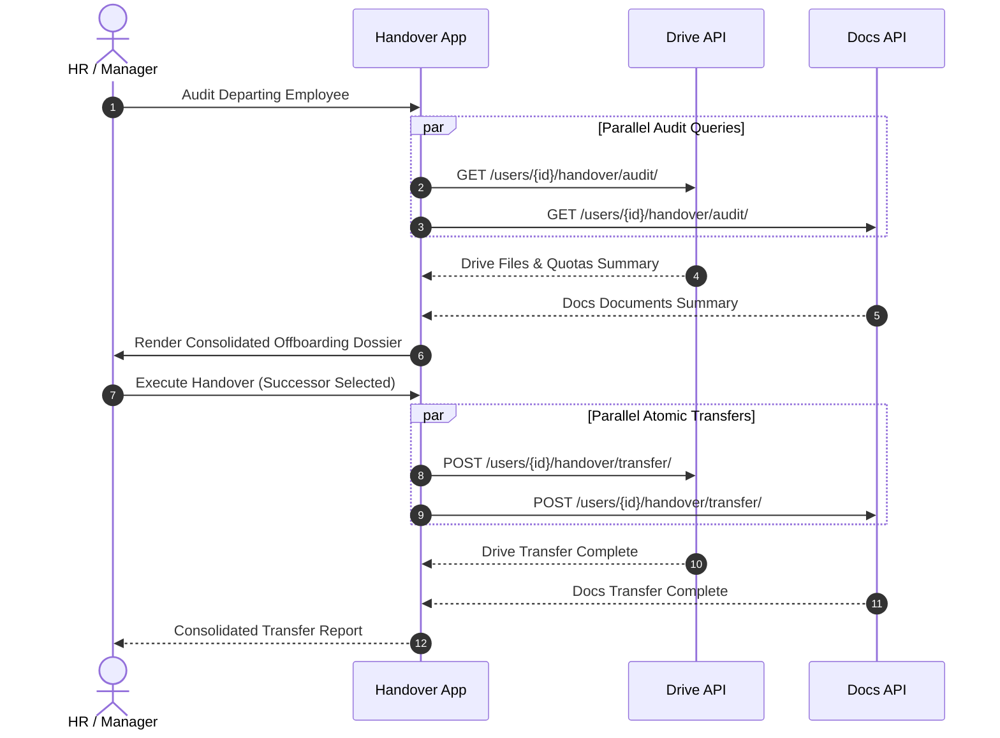

# Technical Study & Specification: File and Document Ownership Transfer & Handover API

## Manager-Led Offboarding in La Suite Numérique

This document provides a comprehensive technical and architectural specification for the **Handover & Ownership Transfer** capabilities across **La Suite Numérique** (the French Public Service and partner state sovereign workspace).

It examines how ownership and storage accountability operate across modalities, details the completed **Drive Handover API**, provides integration guidance for the standalone **Handover Application** (`suitenumerique/handover`), outlines the roadmap for upcoming modalities (**Docs / Impress**), and ensures strict compliance with EU and French legal frameworks (GDPR, ECHR Article 8, workplace privacy jurisprudence, and public archives continuity).

---

## 1. Multi-Repo Architecture & Modality Overview

In La Suite Numérique, offboarding and handover are designed as a decoupled, multi-service architecture:



### Component Roles

1. **The Handover App (`suitenumerique/handover`)**:
   - A dedicated external frontend application outside of Drive and Docs.
   - Provides an intuitive administrative portal for department heads, managers, and HR administrators to oversee departures, audit resources across services, select successors, and execute atomic ownership handovers.
2. **Drive (`suitenumerique/drive`) — Implemented Modality**:
   - Provides the first fully operational Handover API (`/api/v1.0/users/{id}/handover/audit/` and `/transfer/`).
   - Implements two-phase audit/transfer workflows, transparency counts for unshared/trashbin items, row-level locking, and decoupled storage quota handling.
3. **Docs / Impress (`suitenumerique/docs`) — Planned Modality**:
   - Next service to implement the standardized handover contract.
   - Specifically targets preventing catastrophic document destruction under `_delete_documents_single_owner()`.
4. **Accounts (`suitenumerique/accounts`)**:
   - The central identity and authentication provider in La Suite Numérique (OIDC provider, token handling, SIRET / organization claims).
   - **Target Authority for Manager Validation**: This repository is designated to handle the validation part for the manager user in handover workflows:
     1. **Member Discovery**: Exposing an API (e.g. `GET /api/v1.0/organization/members/`) allowing authenticated managers to retrieve the list of subordinates and team members under their supervisory perimeter.
     2. **Dual Managerial Authority**: Verifying that the requesting manager has authority over the **departing user** (`subordinate`) AND also over the **recipient/successor user** (`target_user`).
   - > [!NOTE]
   - > **Current Implementation Status**: This dual manager-subordinate and manager-recipient validation feature is **not yet implemented in the `accounts` app/repo**. Downstream modalities (such as Drive) currently provide stubbed checks (`IsManagerOf`) or rely on administrative (`is_staff`) privileges during development.

---

## 2. Comparative Analysis: Drive vs Docs

| Aspect / Capability | Drive ([`suitenumerique/drive`](https://github.com/suitenumerique/drive)) | Docs / Impress ([`suitenumerique/docs`](https://github.com/suitenumerique/docs)) |
| :--- | :--- | :--- |
| **Tree Hierarchy** | PostgreSQL `ltree` extension ([`core/models.py`](../src/backend/core/models.py)), dot-separated UUID paths (`uuid1.uuid2`). | Materialized Path (`MP_Node`, `django-treebeard`), fixed-step alphanumeric paths (`steplen = 7`). |
| **Available Roles** | `reader`, `editor`, `admin`, `owner` ([`RoleChoices`](../src/backend/core/models.py)) | `reader`, `commenter`, `editor`, `admin`, `owner` (`RoleChoices`) |
| **Ownership Representation** | **Explicit access record**: [`ItemAccess`](../src/backend/core/models.py) with `role = "owner"`. | **Explicit access record**: `DocumentAccess` with `role = "owner"`. |
| **Multi-Owner Support** | **Yes**: Multiple users/teams can hold `role = "owner"` on the same item. | **Yes**: Multiple users/teams can hold `role = "owner"` on the same document. |
| **`creator` Field** | [`Item.creator`](../src/backend/core/models.py) (`ForeignKey(User, on_delete=RESTRICT)`). | `Document.creator` (`ForeignKey(User, on_delete=RESTRICT, null=True)`). |
| **Storage & Binary Files** | Dedicated S3 bucket for binary files. Metadata in `Item` with `size` in bytes. Quotas enforced per user on `Item.creator`. | Dual S3 architecture: collaborative Yjs document state at `{id}/file`, and attachments/media at `{id}/attachments/{file_id}.{ext}` tracked in `Document.attachments` (`ArrayField` with GIN index). Proxied through Nginx `auth_request` (`/media-auth`). No per-user storage quota tracking. |
| **Storage Quota Impact** | **Critical**: Storage quota is counted against [`Item.creator`](../src/backend/core/models.py), NOT on `ItemAccess`. | **None**: Docs has no per-user storage quota tracking or `size` column. |
| **Last-Owner Protection** | Prevents removing or demoting the last owner on root items ([`viewsets.py`](../src/backend/core/api/viewsets.py)). | Prevents leaving or demoting the role if the user is the sole owner. |
| **Handover Status** | **Implemented**: Audit and Transfer endpoints active in core API. | **Planned**: Standardized Handover endpoints to be added in next iteration. |
| **Tree Move Effects** | Moving to root without access reassigns `creator` and grants `owner`. Moving inside folders cleans lower explicit accesses ([`services/accesses.py`](../src/backend/core/services/accesses.py)). | Moving across root trees wipes direct accesses to inherit destination tree scope. |
| **Account Reconciliation** | Reassigns `ItemAccess`, `ItemFavorite`, `LinkTrace`, `Item.creator` (+ invalidates quota cache), and `Invitation.issuer`. | Reassigns `DocumentAccess`, `DocumentFavorite`, `LinkTrace`, threads, comments, and reactions. Does NOT reassign `Document.creator`. |
| **User Deletion Behavior** | **Fails with `RestrictedError`** if the user created any items. Policy expects account deactivation (`is_active = False`). | > [!CAUTION]<br>**Metadata Loss & S3 Orphan Risk**: `_delete_documents_single_owner()` runs a bulk Django SQL delete on documents where the user is sole owner. PostgreSQL rows are permanently destroyed, leaving S3 objects (`{id}/file`, `{id}/attachments/...`) orphaned without soft-delete recovery! |

---

## 3. Technical Realities & Architectural Pitfalls

### 3.1. Drive: The Storage Quota Disconnect

In Drive, permissions and quotas are decoupled by design:

1. **Administrative Rights**: Managed by [`ItemAccess`](../src/backend/core/models.py). An `owner` can rename, move, delete, share, and invite other collaborators.
2. **Quota Accountability**: Managed by [`Item.creator`](../src/backend/core/models.py). Storage consumption is computed via:

   ```sql
   SELECT SUM(size) FROM drive_item WHERE creator_id = %s AND deleted_at IS NULL;
   ```

   Redis caches this value via `invalidate_storage_used_cache([user_id])`.
3. **The Quota Trap in Handover**:
   - If an offboarding workflow blindly reassigns `Item.creator` to the incoming successor, the successor's personal or departmental storage quota may immediately be overwhelmed by gigabytes of departmental archives.
   - Conversely, if `Item.creator` is never reassigned, the departing user continues to bear the quota burden in reporting systems.
   - **Drive Handover Resolution**: By default, `reallocate_storage_quota = False`. The successor receives administrative ownership (`ItemAccess(role='owner')`), while `Item.creator` is preserved to keep storage charged to the predecessor's organizational budget. An explicit option (`reallocate_storage_quota = True`) allows quota reassignment when requested.

### 3.2. Docs: Storage Architecture & The Deletion Purge Hazard

#### Storage Architecture in Docs
Unlike Drive, where every file is an explicit `Item` with an exact byte `size` charged to a user quota, **Docs operates without per-user storage quotas or a `size` database column**:
- **Document Content**: Serialized collaborative state (Yjs) is written directly to S3 at `{document.id}/file` (`Document.file_key`).
- **File Attachments**: Uploaded images and media (up to 10 MB) are stored in S3 at `{document.id}/attachments/{uuid}[-unsafe].{ext}`. Their S3 keys are recorded in the PostgreSQL array field `Document.attachments` (indexed via GIN index `document_attachments_gin`).
- **Media Authorization**: Access to attachments is strictly authenticated via Nginx `auth_request` (`/media-auth`), which issues an internal subrequest to Django to verify the user's `DocumentAccess` on the document before proxying the S3 payload.

#### The Deletion Hazard
Docs overrides `User.delete()`:

```python
def delete(self, using=None, keep_parents=False):
    with transaction.atomic():
        self._delete_user_shared_documents_accesses() # Leaves multi-owner docs intact
        self._delete_documents_single_owner()         # PERMANENTLY PURGES single-owner docs!
        self._clear_user_created_documents()          # Sets creator=None on remaining docs
        return super().delete(using=using, keep_parents=keep_parents)
```

- If an administrator deactivates or cleans up a departing user before performing a document handover:
  - **Single-Owner Documents are destroyed in PostgreSQL**: `_delete_documents_single_owner()` executes `Document.objects.filter(accesses__user=self, accesses__role=RoleChoices.OWNER).delete()`.
  - **S3 Objects become orphaned**: Because this is a bulk Django QuerySet delete, no model-level S3 cleanup hooks or signals are fired. The `{document.id}/file` and `{document.id}/attachments/...` binaries remain orphaned in S3.
  - **There is no soft-delete or trashbin recovery** for this cascade: standard `Document.soft_delete()` (which honors `TRASHBIN_CUTOFF_DAYS`) is completely bypassed.
  - > [!CAUTION]
    > **Public Records Liability**: Under French law (*Code du patrimoine*, Art. L. 211-1), all digital documents and data created by public agents in the exercise of their duties are legally **public archives from inception** (*"y compris les données, quel que soit le support"*). Deleting these documents without archival authorization (*visa d'élimination*) constitutes a criminal offense under **Article L. 214-3 Code du patrimoine** (3 years imprisonment, €45,000 fine) and **Article 432-15 Code pénal** (unlawful destruction of public records: 10 years imprisonment, €1,000,000 fine).
  - **Docs Handover Requirements**:
    1. **Reassign Administrative Ownership (`DocumentAccess`)**: Granting the incoming successor `DocumentAccess(role='owner')` ensures `owner_count >= 2`. When the predecessor is removed, `_delete_user_shared_documents_accesses()` simply deletes the departing user's access, completely protecting the document from `_delete_documents_single_owner()`.
    2. **Reassign `Document.creator`**: Update `Document.creator = successor` to prevent `_clear_user_created_documents()` from wiping the creator metadata (`creator = None`), preserving author provenance and historical auditability.

---

## 4. Manager-Led Transfer Workflow

### 4.1. Why the Manager Must Steer the Handover

In public sector and enterprise organizations, departing employees frequently:
- Depart abruptly (mutation, sick leave, end of contract, resignation) without organizing their files.
- Store work-related files in their private root workspace without sharing them.
- Do not know who will succeed them.

Therefore, the **line manager** or an **authorized organization administrator** must have the supervisory tooling (via the standalone Handover App) to:
1. **Audit** the departing agent's digital assets (counts, storage volume, sole-owner vs shared state, skipped items).
2. **Designate a successor** (colleague, manager, or shared departmental space).
3. **Execute an atomic transfer** to guarantee service continuity.

### 4.2. End-to-End Orchestration Flow



---

## 5. EU & French Legal Framework: Rigorous Statutory Verification

Empowering a manager to audit and transfer an employee's files directly intersects with European fundamental rights and data protection laws. The technical implementation strictly adheres to the following statutory framework:

### 5.1. GDPR (Regulation EU 2016/679)

1. **Lawful Basis (Article 6)**:
   - **Public Sector**: The handover process is justified under **Article 6(1)(e)** ("task carried out in the public interest or in the exercise of official authority") and **Article 6(1)(c)** ("compliance with a legal obligation" under public archival and administrative continuity statutes).
   - **Restriction for Public Bodies**: Under **Article 6(1) second subparagraph**, public authorities are **expressly prohibited** from relying on Article 6(1)(f) ("legitimate interests") when performing tasks within their public remit.
   - **Private Sector**: Relies on **Article 6(1)(f)** ("legitimate interests" of business continuity) balanced against employee rights, subject to **Article 88** (national rules on employee data processing).
2. **Purpose Limitation (Article 5(1)(b))**:
   - The transfer is strictly confined to ensuring **business and public service continuity** (*continuité du service public*). It cannot be repurposed for disciplinary investigations or performance surveillance.
3. **Data Minimization (Article 5(1)(c))**:
   - The manager audit screen displays **metadata only** (titles, sizes, update dates, sharing counts) rather than exposing indiscriminate file content previews or opening private documents.
4. **Accountability & Logging (Article 5(2))**:
   - Every administrative audit query and ownership transfer produces an immutable audit log recording the manager's identity, IP address, timestamp, affected resource IDs, and recipient.
5. **Right to Erasure Limitations (Article 17)**:
   - Under **Article 17(3)(b) and 17(3)(d)**, public sector employees **cannot** invoke the "right to be forgotten" to demand the erasure of professional files or public documents. Personal files inadvertently stored, however, must be purged under Article 17(1).
6. **Right of Access (Article 15)**:
   - Under *Cass. soc., 18 juin 2025 (n° 23-19.022)*, professional emails and digital communications contain personal data; departing workers retain an enforceable right of access to their own data under Art. 15 GDPR, but this does not confer any exclusive right of retention over administrative records.

### 5.2. ECHR Article 8 & Workplace Privacy Jurisprudence

- **Foundational Jurisprudence**: *Halford v. UK (1997)* and *Copland v. UK (2007)* established that employees have a **reasonable expectation of privacy** regarding workplace communications and files.
- **The Six Procedural Criteria (*Bărbulescu v. Romania [GC 2017]*)**: Employer monitoring must satisfy six cumulative criteria: prior notification, restricted spatial/temporal scope, legitimate aim, subsidiarity (less intrusive methods), proportional consequences, and procedural safeguards.
- **The Cornerstone French Case (*Libert c. France, 22 Feb 2018, no. 588/13*)**:
  - The ECHR validated France's presumption of professional use and ruled that naming a folder **"données personnelles" (personal data)** was **insufficient** to confer Article 8 privacy protection, as employees routinely process personal data for work.
  - To benefit from secrecy of correspondence, the folder/file must be explicitly labeled **"Personnel"** or **"Privé"**.

### 5.3. French Labor & Administrative Law

1. **The Presumption of Professional Use (*Présomption de professionnalisme*)**:
   - Formulated by *Cass. soc., 17 mai 2005 (Cathonet)* and consecrated by *Cass. soc., 18 octobre 2006* (extended to emails by *Cass. soc., 30 mai 2007* & *15 déc. 2010*): files and communications on work tools are **presumed professional**.
   - The line manager has the full legal right to open, inspect, and reassign them for business continuity, **even in the employee's absence**, without prior notice.
   - Transposed to the public sector by administrative courts (*CAA Douai, 26 mai 2011*; *CAA Marseille, 10 mai 2016*; *CAA Toulouse, 20 juin 2023*; *CE, 20 févr. 2026, n° 497066*).
2. **Protection of Personal Files (*Arrêt Nikon*, Cass. soc., 2 oct. 2001, n° 99-42.942)**:
   - Files and folders explicitly marked as **"Personnel"** or **"Privé"** are protected by the secrecy of correspondence (Art. 9 Code civil, Art. 8 ECHR, Art. 226-15 Code pénal).
   - A manager **cannot open or transfer** these files in the employee's absence, except when authorized under a judicial order (*ordonnance sur requête*, Art. 145 CPC) or in case of a severe emergency (*risque ou événement particulier*).
3. **Public Archives (*Code du patrimoine*, Art. L. 211-1 et seq.)**:
   - All digital documents and data created by public agents are **public archives** from inception. Unauthorized destruction is a criminal misdemeanor (*Art. L. 214-3*: 3 years imprisonment, €45,000 fine; *Art. 432-15 Code pénal*: 10 years imprisonment, €1,000,000 fine).
4. **Public Service Continuity & Statutory Duties (*Code général de la fonction publique - CGFP*)**:
   - Under the constitutional principle of public service continuity and statutory duties (**Articles L. 121-1, L. 121-7, L. 121-9, and L. 121-10 CGFP** on hierarchical obedience):
     - Public agents have **no property right and no right of retention** over administrative creations (*Code de la propriété intellectuelle*, Art. L. 131-3-1).
     - Agents are legally required to execute handover instructions. Withholding access or deleting professional files constitutes a serious disciplinary offense.
5. **Procedural Safeguards via Pre-Departure Grace Period**:
   - Administrations must provide pre-departure notice and a self-service window for employees to export private files and clean their workspaces prior to account deactivation.

---

## 6. Drive Handover API: Technical Specification & Implementation

The Drive Handover API is fully implemented within [`suitenumerique/drive`](https://github.com/suitenumerique/drive), exposed via [`UserViewSet`](../src/backend/core/api/viewsets.py) and encapsulated in [`core/services/handover.py`](../src/backend/core/services/handover.py).

### 6.1. Endpoint 1: Handover Audit

- **HTTP Route**: `GET /api/v1.0/users/{user_id}/handover/audit/`
- **Permission**: `IsAuthenticated, IsManagerOf`
- **Purpose**: Compiles a comprehensive inventory of the departing employee's files and folders, computing summary metrics and transparent counts for items outside the shared transfer perimeter.

#### Summary Metrics & Transparency Schema

The audit endpoint returns high-level metrics accompanied by an explicit breakdown of skipped items:

```json
{
  "departing_user": {
    "id": "2c6c1f9f-9b0a-46b9-be85-d63983d1a750",
    "email": "subordinate@example.com",
    "full_name": "John Doe (Departing Employee)"
  },
  "summary": {
    "total_items": 19,
    "total_bytes": 183756048,
    "sole_owner_count": 14,
    "shared_count": 5,
    "skipped_unshared_count": 2,
    "skipped_unshared_bytes": 180000,
    "skipped_trash_count": 2,
    "skipped_trash_bytes": 320000
  },
  "items": [
    {
      "id": "a0000000-0000-0000-0000-000000000001",
      "title": "root_notes.txt",
      "type": "file",
      "size": 2048,
      "role": "owner",
      "is_sole_owner": true,
      "is_shared": true,
      "other_accesses_count": 1,
      "created_at": "2026-09-16T12:00:00Z",
      "updated_at": "2026-09-16T12:00:00Z",
      "path": "/root_notes.txt",
      "is_skipped_unshared": false
    }
  ]
}
```

#### Meaning of Metrics

- `total_items`: Total number of active files and folders administered by the departing user.
- `sole_owner_count`: Items where the departing user is the **only owner** (`other_owners_count == 0`). These represent assets at risk of orphanhood.
- `shared_count`: Items with active collaborators (`other_accesses_count > 0`).
- `skipped_unshared_count` & `skipped_unshared_bytes`: Active items in the user's personal root workspace that have **zero collaborators**. Transparently reported so administrators understand what remains untransferred.
- `skipped_trash_count` & `skipped_trash_bytes`: Soft-deleted items currently in the trashbin, preserved under public archive rules.

---

### 6.2. Endpoint 2: Handover Transfer (Dry-Run & Execution)

- **HTTP Route**: `POST /api/v1.0/users/{user_id}/handover/transfer/`
- **Permission**: `IsAuthenticated, IsManagerOf`
- **Purpose**: Atomically transfers ownership of items to a designated recipient. Supports a dry-run validation preview mode as well as transactional execution.

#### Request Parameters

| Parameter | Type | Required | Default | Description |
| :--- | :--- | :--- | :--- | :--- |
| `recipient_id` | `UUID` / `string` | **Yes** | — | UUID or email of the incoming successor. Must be an authorized member of the manager's team. |
| `item_ids` | `UUID[]` | **Yes** | — | Explicit list of root item IDs selected by the manager. If a folder ID is passed, all its descendants are automatically cascaded. |
| `dry_run` | `boolean` | No | `false` | When `true`, simulates transfer, checks recipient quota, and returns summary without modifying the database. |
| `reallocate_storage_quota` | `boolean` | No | `false` | When `false` (default), preserves `Item.creator` to keep storage volume charged to the predecessor's budget. When `true`, reassigns `Item.creator = recipient`. |
| `departing_user_action` | `string` | No | `"revoke"` | `"revoke"` (removes departing user's access) or `"keep_reader"` (demotes departing user to reader). |

> [!NOTE]
> **Single vs. Multi-Recipient Assignments**: The API currently accepts a single `recipient_id` per request to keep the frontend client contract lightweight and simple without breaking existing UI integration. Future iterations may extend this schema to support assigning multiple recipients per item or batch arrays across distinct collaborators.

#### Authorization & Recipient Validation
Before transfer execution or dry-run simulation, the endpoint verifies that `recipient` belongs to the requesting manager's team via `is_user_in_manager_team(request.user, recipient)`. If the recipient is outside the manager's team perimeter, the request is rejected with `400 Bad Request`:

```json
{
  "errors": [
    {
      "attr": "recipient_id",
      "code": "invalid",
      "detail": "Recipient '<email>' is not a member of the manager's team."
    }
  ]
}
```

#### Request Payload Example

```json
{
  "recipient_id": "2d915b4b-a763-4190-83a9-7380982d561e",
  "item_ids": [
    "a0000000-0000-0000-0000-000000000001",
    "a0000000-0000-0000-0000-000000000020"
  ],
  "dry_run": false,
  "reallocate_storage_quota": false,
  "departing_user_action": "revoke"
}
```

#### Response Example (`200 OK`)

```json
{
  "dry_run": false,
  "status": "completed",
  "summary": {
    "items_transferred": 5,
    "bytes_reallocated": 0,
    "reallocate_storage_quota": false,
    "departing_user_action": "revoke",
    "destination_folder_id": "a0000000-0000-0000-0000-000000000099"
  },
  "recipient": {
    "id": "2d915b4b-a763-4190-83a9-7380982d561e",
    "email": "drive@drive.world"
  },
  "items": [
    {
      "id": "a0000000-0000-0000-0000-000000000001",
      "title": "root_notes.txt",
      "type": "file",
      "size": 2048,
      "depth": 1
    }
  ]
}
```

#### Atomic Execution Guarantees (`@transaction.atomic`)

1. **Pessimistic Row-Level Locks**: Employs `Item.objects.select_for_update()` to prevent TOCTOU race conditions (e.g. concurrent moves or deletions).
2. **Quota Verification**: If `reallocate_storage_quota = True`, verifies that the recipient has sufficient available storage in their quota before applying changes.
3. **Destination Folder Isolation**: Creates a dedicated folder (`"Passation - [Full Name] (YYYY-MM-DD)"`) in the recipient's root workspace, moving unshared root files into it to avoid cluttering the successor's drive.
4. **Dual Reassignment**:
   - Grants `ItemAccess(role=RoleChoices.OWNER)` to the recipient.
   - If `reallocate_storage_quota = True`, updates `Item.creator = recipient` and invalidates Redis quota caches via `invalidate_storage_used_cache`.
5. **Access Cleanup**: Revokes or demotes the departing user's permissions according to `departing_user_action`.

---

### 6.3. Endpoint 3: Handover File Deletion (Current Status & Planned Refactor)

- **Current Route**: `DELETE /api/v1.0/users/{user_id}/handover/delete/`
- **Permission**: `IsAuthenticated, IsManagerOf`
- **Current Payload**: `{"item_id": "<UUID>", "title": "<string>"}`
- **Current Behavior**: Soft-deletes and immediately hard-deletes the file, dispatching Celery `process_item_purge` to permanently purge the S3 binary.

#### Planned Refactoring Scope (Later Changes Needed)

1. **HTTP Protocol & REST Semantics**:
   - Sending a JSON payload within a `DELETE` request violates RFC 9110 §9.3.5 and common API gateway/proxy conventions (bodies in DELETE requests are often stripped or rejected by intermediate proxies and WAFs). Additionally, `/delete` in the URI is redundant with the `DELETE` HTTP verb.
   - *Target RESTful endpoints*:
     - **Single Item Deletion**:
       ```http
       DELETE /api/v1.0/users/{user_id}/handover/items/{item_id}/
       ```
       No request body required. Returns `204 No Content` upon successful deletion.
     - **Batch Item Deletion**:
       ```http
       POST /api/v1.0/users/{user_id}/handover/batch-delete/
       ```
       Body: `{"item_ids": ["<UUID1>", "<UUID2>"]}`. Returns `200 OK` with execution summary.
2. **Lifecycle & Data Retention (*Code du patrimoine* L. 211-1)**:
   - Immediate hard-delete and S3 object purge leaves zero recovery window, creating legal liability for public archival loss.
   - *Target change*: Replace hard-deletion with standard soft-deletion (`item.soft_delete()`), moving discarded files to the trashbin to preserve public archival retention schedules with an administrative recovery window.
3. **Query Perimeter Correction**:
   - Currently, `get_departing_user_administered_items(departing_user)` restricts to shared items (`other_accesses_count > 0`), causing unshared/personal files (`skipped_unshared_*`) to return `404 Not Found`, while shared collaborative team files are permitted to be deleted.
   - *Target change*: Refactor query to allow selecting unshared or user-created files, while protecting shared collaborative assets from unilateral deletion without co-owner consent.
4. **Batch & Folder Support**:
   - Extend beyond single-file deletion to accept a list of `item_ids` and support empty folders or cascading folder deletion.
5. **Title Parameter Redundancy**:
   - Validate `item.title == serializer.validated_data["title"]` as a confirmation guardrail, or remove the unverified parameter.

---

## 7. External Handover Client Integration Guide

The handover user experience is hosted inside the standalone **Handover Application** ([`suitenumerique/handover`](https://github.com/suitenumerique/handover)). This section serves as the integration guide for frontend developers building or consuming offboarding workflows.

### 7.1. Authentication & Security Headers

All HTTP requests from the Handover App to Drive must include:
- **Authentication**: Session cookie (`Cookie: sessionid=...`) or OIDC Bearer token (`Authorization: Bearer <jwt>`).
- **CSRF Protection**: `X-CSRFToken: <token>` extracted from cookies.
- **CORS Configuration**: The Drive backend must allow the origin of the Handover application (`CORS_ALLOWED_ORIGINS`).

### 7.2. Client Error Handling Matrix

| HTTP Status | Condition | Recommended Client UI Action |
| :--- | :--- | :--- |
| `200 OK` | Audit compiled or transfer executed. | Render metrics dashboard or confirmation receipt. |
| `400 Bad Request` | Invalid payload, empty `item_ids`, or quota exceeded. | Display backend error message from `detail`. |
| `401 Unauthorized` | Missing or expired credentials / MFA step-up required. | Redirect user to SSO login / prompt MFA re-auth. |
| `403 Forbidden` | `IsManagerOf` rejected (Anti-Self Handover, or caller lacks managerial rights). | Display: *"Vous n'avez pas les habilitations nécessaires pour gérer ce collaborateur."* |
| `404 Not Found` | User UUID does not exist. | Display: *"Utilisateur introuvable."* |
| `429 Too Many Requests` | Throttling limit reached. | Display: *"Trop de requêtes. Veuillez patienter avant de réessayer."* |

### 7.3. Security Architecture & Zero-Trust Verification Workflow

To guard against session hijacking, cookie theft (infostealers), and unauthorized cross-tenant operations, the offboarding and handover workflow adopts a zero-trust, challenge-response model backed by `accounts`:

#### 1. Threat Model: Cookie & Token Theft Mitigation
- **Risk**: A manager's workstation is compromised by infostealer malware, exfiltrating browser session cookies or standard OIDC access tokens.
- **Defense (SSO MFA Freshness & Short TTL)**:
  - Auditing an employee's private files or performing mass ownership transfer is a high-privilege supervisory action.
  - The API inspects the `auth_time` claim within the manager's OIDC JWT.
  - **Strict TTL Enforcement**: If `now() - auth_time > 300` (5 minutes TTL), the request is rejected with `401 Unauthorized` and header:
    ```http
    WWW-Authenticate: Bearer error="step_up_required", error_description="Recent MFA re-authentication required"
    ```
  - The client is redirected to `accounts` for an interactive step-up re-authentication challenge (`prompt=login` or WebAuthn/FIDO2).

#### 2. Ephemeral Action-Scoped Tokens (`handover:audit` & `handover:transfer`)
Rather than granting broad administrative scopes, `accounts` issues ephemeral, dedicated tokens with short lifespans (5–10 minutes):

| Scoped Token | Scope Name | Intended Endpoint | Bound Claims |
| :--- | :--- | :--- | :--- |
| **Audit Token** | `handover:audit` | `GET /users/{id}/handover/audit/` | `sub` (manager), `aud` (`drive`), `departing_user` |
| **Transfer Token** | `handover:transfer` | `POST /users/{id}/handover/transfer/` | `sub` (manager), `aud` (`drive`), `departing_user`, `recipient_user` |

#### 3. Token Verification by Modality Backends (Drive, Docs)
When Drive receives a request with a scoped Bearer token:
1. **Cryptographic Signature Verification**: Validates the JWT signature against `accounts` public keys via JWKS (`/api/v1.0/o/.well-known/jwks.json`).
2. **Audience & Scope Validation**: Verifies `aud == "suitenumerique/drive"` and `scope == "handover:audit"` (or `"handover:transfer"`).
3. **Claim Binding Check**: Verifies that the URL's `{user_id}` matches the token's `departing_user` claim, and that `recipient_id` matches `recipient_user`.
4. **Token Introspection (Optional Defense-in-Depth)**: Drive can call `POST /api/v1.0/o/introspect/` on `accounts` to verify real-time revocation status.

---

## 8. Quick Setup Guide & Interactive Endpoint Testing

This section allows developers, reviewers, and open-source contributors to boot up the environment, seed the handover test dataset, and test all handover endpoints (`audit`, `simulation/dry-run`, and `transfer`) in less than 5 minutes.

### 8.1. 5-Minute Quick Start

```bash
# 1. Boot the development services (Django API, PostgreSQL, Redis, MinIO, Keycloak)
make run
# or: docker compose up -d

# 2. Provision deterministic handover personas and the rich test dataset
docker compose exec app-dev python manage.py create_handover_demo
```

---

### 8.2. Seeded Personas & Credentials Matrix

All test accounts share the standard development password: **`drive`**.

| Persona | Role in Handover | Email | Fixed UUID | Initial Privileges |
| :--- | :--- | :--- | :--- | :--- |
| **Line Manager** | **Auditor & Executor** | `manager@example.com` | `021d6063-a251-472a-919e-325565b35c49` | `is_staff: True`, Manager authority |
| **Departing Employee** | **Audited Agent** (John Doe) | `subordinate@example.com` | `2c6c1f9f-9b0a-46b9-be85-d63983d1a750` | `is_staff: False`, Resource creator/owner |
| **Successor 1 (Alice)** | **Candidate Recipient** | `drive@drive.world` | `2d915b4b-a763-4190-83a9-7380982d561e` | `is_staff: False`, Successor candidate |
| **Successor 2 (Bob)** | **Candidate Recipient** | `bob.colleague@example.com` | `2d915b4b-a763-4190-83a9-7380982d562e` | `is_staff: False`, Successor candidate |
| **Successor 3 (Charlie)** | **Candidate Recipient** | `charlie.colleague@example.com` | `2d915b4b-a763-4190-83a9-7380982d563e` | `is_staff: False`, Successor candidate |

> [!TIP]
> **Authentication Options**:
> 1. **E2E Auth Bypass (Instant / Recommended for CLI & Scripts)**: `POST /api/v1.0/e2e/user-auth/` establishes a Django session cookie immediately without Keycloak redirects.
> 2. **Keycloak OIDC Code Flow**: Standard browser login through Keycloak (`http://localhost:8080`, realm `drive`) using any of the usernames: `manager`, `subordinate`, `drive`, `bob`, or `charlie` with password `drive`.

---

### 8.3. Copy-Paste cURL Recipes

All commands below can be executed directly from your terminal.

#### Step 1: Authenticate as the Line Manager (Get Session & CSRF)
```bash
# Obtain session cookie
curl -s -c cookies.txt -X POST http://localhost:8071/api/v1.0/e2e/user-auth/ \
  -H "Content-Type: application/json" \
  -d '{"email": "manager@example.com"}'

# Extract the CSRF token for mutating requests
CSRF=$(grep csrftoken cookies.txt | awk '{print $7}')
echo "Authenticated as Manager. CSRF Token: $CSRF"
```

#### Step 2: Audit the Departing Employee's Files
```bash
SUBORDINATE_ID="2c6c1f9f-9b0a-46b9-be85-d63983d1a750"

curl -s -b cookies.txt http://localhost:8071/api/v1.0/users/$SUBORDINATE_ID/handover/audit/ | jq .
```
**Expected Response Excerpt**:
```json
{
  "departing_user": {
    "id": "2c6c1f9f-9b0a-46b9-be85-d63983d1a750",
    "email": "subordinate@example.com",
    "full_name": "John Doe (Departing Employee)"
  },
  "summary": {
    "total_items": 26,
    "total_bytes": 204766048,
    "sole_owner_count": 13,
    "shared_count": 26,
    "skipped_unshared_count": 2,
    "skipped_unshared_bytes": 180000,
    "skipped_trash_count": 2,
    "skipped_trash_bytes": 320000
  },
  "items": [ ... ]
}
```

#### Step 3: Run a Handover Simulation (Dry-Run)
Test the impact of transferring a folder (`4_Ongoing_Projects`) to Alice Martin (`drive@drive.world`) without applying any changes:
```bash
ALICE_ID="2d915b4b-a763-4190-83a9-7380982d561e"
FOLDER_ID="a0000000-0000-0000-0000-000000000040"

curl -s -b cookies.txt -X POST http://localhost:8071/api/v1.0/users/$SUBORDINATE_ID/handover/transfer/ \
  -H "Content-Type: application/json" \
  -H "X-CSRFToken: $CSRF" \
  -d "{
    \"recipient_id\": \"$ALICE_ID\",
    \"item_ids\": [\"$FOLDER_ID\"],
    \"dry_run\": true
  }" | jq .
```
**Expected Output**: Reports `dry_run: true`, lists cascading subfiles included, and checks quota headroom.

#### Step 4: Execute an Atomic Ownership Transfer
Execute the real transfer, granting Alice administrative ownership while preserving historical quota accountability:
```bash
curl -s -b cookies.txt -X POST http://localhost:8071/api/v1.0/users/$SUBORDINATE_ID/handover/transfer/ \
  -H "Content-Type: application/json" \
  -H "X-CSRFToken: $CSRF" \
  -d "{
    \"recipient_id\": \"$ALICE_ID\",
    \"item_ids\": [\"$FOLDER_ID\"],
    \"dry_run\": false,
    \"reallocate_storage_quota\": false,
    \"departing_user_action\": \"revoke\"
  }" | jq .
```
**Expected Output**:
```json
{
  "status": "completed",
  "transferred_at": "2026-09-17T18:47:50.123456Z",
  "recipient": {
    "id": "2d915b4b-a763-4190-83a9-7380982d561e",
    "email": "drive@drive.world",
    "full_name": "Alice Martin (Successor 1)"
  },
  "summary": {
    "items_transferred": 6,
    "bytes_reallocated": 0,
    "reallocate_storage_quota": false,
    "departing_user_action": "revoke"
  }
}
```

---

### 8.4. One-Click Browser Console Login

If you are developing or testing the frontend UI (`http://localhost:3000` or `http://localhost:8071`), paste this snippet into your browser's Developer Tools Console (F12) to instantly sign in:

```javascript
// Instant Login as Line Manager
await fetch('/api/v1.0/e2e/user-auth/', {
  method: 'POST',
  headers: {'Content-Type': 'application/json'},
  body: JSON.stringify({email: 'manager@example.com'}),
  credentials: 'include'
});
location.reload();
```

To switch to other personas in the browser console, simply replace the email with `subordinate@example.com` or `drive@drive.world`.

---

### 8.5. Seeded Test Dataset Breakdown

The `create_handover_demo` command generates 26 total audit items balanced evenly (50% sole-owner, 50% multi-owner) across 9 canonical offboarding scenarios (deterministic UUID prefix: `a0000000-0000-0000-0000-`):

| Scenario | Path / Title | Items Count | Ownership Status | Collaborators | Handover Test Purpose |
| :--- | :--- | :---: | :---: | :--- | :--- |
| **Case 0** | `root_notes.txt` | 1 | Sole Owner (`True`) | Alice (Reader) | Tests orphan risk on standalone root files. |
| **Case 1** | `1_Empty_Folder/` | 1 | Sole Owner (`True`) | Alice (Reader) | Tests transferring empty containers. |
| **Case 2** | `2_Diverse_And_Long_Filenames/` | 4 | Sole Owner (`True`) | Alice, Bob, Charlie | Tests UI table cell truncation, large PDFs, CSVs, PNGs. |
| **Case 3** | `3_Deep_Folder_Hierarchy/` | 7 | Sole Owner (`True`) | Alice (Reader) | Tests 4-level deep folder trees and selective sub-tree inheritance. |
| **Case 4** | `4_Ongoing_Projects/` | 6 | Multi-Owner (`False`) | Alice, Bob, Charlie (Co-owners) | Tests multi-ownership, subfolder `Shared_Deliverables/`, joint contracts, roadmaps. |
| **Case 5** | `5_Design_Resources/` | 2 | Not Sole Owner (`False`) | Alice (Owner), John Doe (Admin) | Tests non-owner reporting: John Doe leaving does not orphan Alice's folder. |
| **Case 6** | `6_Unshared_Personal_Folder/` | 2 | Skipped (Unshared) | None (0 Collaborators) | Confidential personal files; surfaced under `skipped_unshared_count`. |
| **Case 7** | `7_Old_Drafts_In_Trashbin/` | 2 | Skipped (Trash) | Alice (Reader) | Soft-deleted items in trash; surfaced under `skipped_trash_count`. |
| **Case 8** | `8_CoOwned_Department_Workspace/` | 4 | Multi-Owner (`False`) | Alice, Bob, Charlie (4 Co-owners) | Cross-functional team workspace co-owned by all 4 agents. |

---

### 8.6. Automated Verification (Pytest)

Run the full automated test suite verifying audit filters, multi-ownership classification, dry-run simulation, selective transfer, and cascading permissions:

```bash
docker compose exec -T -e DJANGO_CONFIGURATION=Test app-dev \
  pytest core/tests/test_services_handover.py demo/tests/test_commands_create_demo.py
```
Output:
```
======================== 19 passed, 1 warning in 10.49s ========================
```

---

### 8.7. Bruno API Collection

A complete, Git-native [Bruno](https://www.usebruno.com/) collection is available in [`bruno/`](../bruno):
- `1-Auth/`: Login as Manager, Subordinate, or Colleague with automatic cookie extraction.
- `2-Audit/`: Handover Audit and Anti-Self Audit tests.
- `4-Transfer/`: Transfer Dry-Run, Execution, Anti-Self checks, and Post-Transfer verification.
- `collection.bru`: Includes pre-request fallback variables so requests execute cleanly even when "No Environment" is selected.

---

## 9. Architectural Decisions (The "Why")

1. **Storage Quota Policy: Why Default to `reallocate_storage_quota = False`?**:
   - In Drive, storage usage is queried via `SELECT SUM(size) FROM drive_item WHERE creator_id = %s`.
   - In public administration, a successor taking over a project should not have their storage quota saturated by years of departmental archives.
   - **Decision**: Handover defaults to `reallocate_storage_quota = False`. The successor receives administrative control (`role='owner'`), while `Item.creator` remains unchanged, attributing storage to the predecessor's organization budget.
2. **What Happens to a File When its Creator is Deactivated (`is_active = False`)?**:
   - **Persistence**: Files are never deleted. `Item.creator` has `on_delete=models.RESTRICT`, preventing hard database deletion of the user.
   - **Access**: Collaborators holding `ItemAccess` retain full access. The deactivated status of the creator has zero effect on colleagues.
   - **Accountability**: Leaving `Item.creator` intact preserves the historical record of who created the file.
3. **Why Surface Transparency Counts (`skipped_unshared_*`, `skipped_trash_*`)?**:
   - Hiding unshared or trashbin items creates a false sense of completeness. Explicit counts inform administrators of the full picture while adhering to data minimization.
4. **Anti-Self Handover Rule**:
   - A departing agent cannot authorize or execute a handover on themselves. The feature is strictly supervisory for managers and administrators.

---

## 10. Roadmap: Extending Handover to Docs / Impress & Other Modalities

With the Drive Handover API fully established, upcoming iterations will extend this pattern to the rest of La Suite Numérique:

### 10.1. Next Modality: Docs / Impress (`suitenumerique/docs`)

1. **API Endpoints**:
   - `GET /api/v1.0/users/{user_id}/handover/audit/`: Reports all documents where user is creator, sole owner, or collaborator.
   - `POST /api/v1.0/users/{user_id}/handover/transfer/`: Reassigns `DocumentAccess(role='owner')` and crucially updates `Document.creator = successor`.
2. **Storage Architecture & Quotas**:
   - Docs has no per-user storage quota (collaborative state is stored in S3 at `{document.id}/file`, and attachments at `{document.id}/attachments/{uuid}.{ext}` tracked in `Document.attachments`). Therefore, transfers do not consume or require quota recalculations.
3. **Purge Protection**:
   - Reassigning `DocumentAccess(role='owner')` provides multi-owner immunity against `_delete_documents_single_owner()` bulk SQL deletion upon user offboarding, while reassigning `Document.creator = recipient` preserves author provenance and legal retention under *Code du patrimoine* Article L. 211-1.

### 10.2. Unified Orchestration in the Handover App (`suitenumerique/handover`)

The standalone Handover App will serve as the single administrative orchestrator:



### 10.3. Consolidated Roadmap of Later Changes & Technical Debt

This roadmap synthesizes all required future architectural refactorings, security requirements, and standards alignments across La Suite Numérique:

| Target Domain / Component | Later Change Needed | Rationale & Standards Alignment |
| :--- | :--- | :--- |
| **Accounts (`suitenumerique/accounts`)** | **Manager Member Discovery (`GET /api/v1.0/organization/members/`)** | Allows Handover App to dynamically populate managed subordinates and potential organizational successors directly from the manager's authenticated session. |
| **Accounts (`suitenumerique/accounts`)** | **Dual Managerial Authority Validation** | Enforces the requirement that a manager must have authority over **both** the departing user and the recipient/successor user before authorizing transfer. *(Currently not implemented in `accounts`).* |
| **Accounts (`suitenumerique/accounts`)** | **MFA Freshness Check (`auth_time` TTL $\le 300\text{s}$)** | Guarantees that sensitive handover operations require recent MFA re-authentication, mitigating the impact of stolen session cookies / infostealers. |
| **Accounts (`suitenumerique/accounts`)** | **Action-Scoped Tokens (`handover:audit`, `handover:transfer`)** | Mints ephemeral, purpose-bound JWTs (5–10 min TTL) cryptographically binding `departing_user` and `recipient_user` claims. |
| **Drive (`suitenumerique/drive`)** | **Multi-Recipient Assignments per Item / Batch** | Extends single `recipient_id` to allow distributing subsets of files or batch arrays across multiple team members in a single offboarding workflow without breaking current frontend contract. |
| **Drive (`suitenumerique/drive`)** | **RESTful Deletion Route Refactor** | Replaces `DELETE .../handover/delete/` (body) with `DELETE /api/v1.0/users/{user_id}/handover/items/{item_id}/` (`204 No Content`) and `POST .../batch-delete/` to adhere to RFC 9110 §9.3.5. |
| **Drive (`suitenumerique/drive`)** | **Soft-Delete Lifecycle for Handover File Purge** | Replaces immediate hard purge with standard soft-deletion (`item.soft_delete()`), moving discarded files to the trashbin to satisfy legal retention and recovery windows (*Code du patrimoine* L. 211-1). |
| **Drive (`suitenumerique/drive`)** | **Encapsulate Input in `HandoverTransferSerializer`** | Replaces raw `request.data.get(...)` in `UserViewSet` with a DRF serializer to ensure automatic schema validation and OpenAPI documentation. |
| **Drive (`suitenumerique/drive`)** | **RESTful Audit Endpoint Normalization** | Migrates route from `.../handover/audit/` to standard REST resource `GET /api/v1.0/users/{user_id}/handover/`. |
| **Docs / Impress (`suitenumerique/docs`)** | **Standardized Handover API & Purge Protection** | Implements the Handover contract in Docs and immunizes documents against `_delete_documents_single_owner()` permanent destruction upon user offboarding. |

